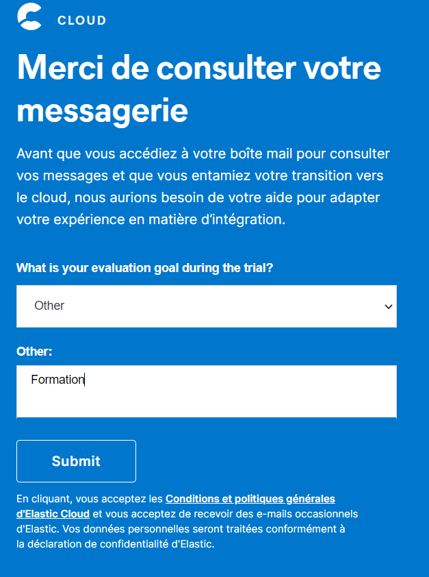
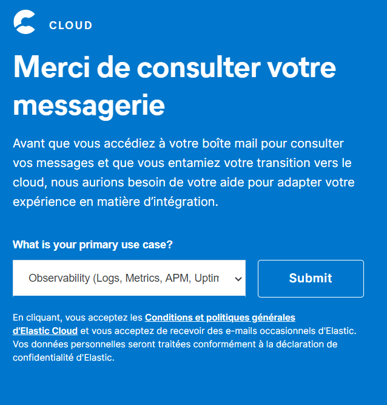
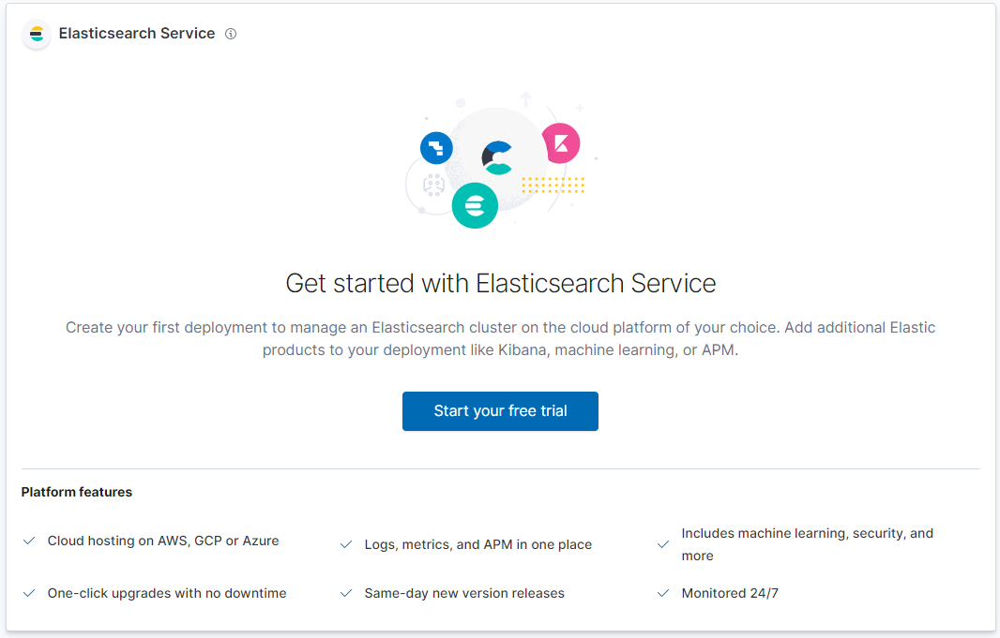
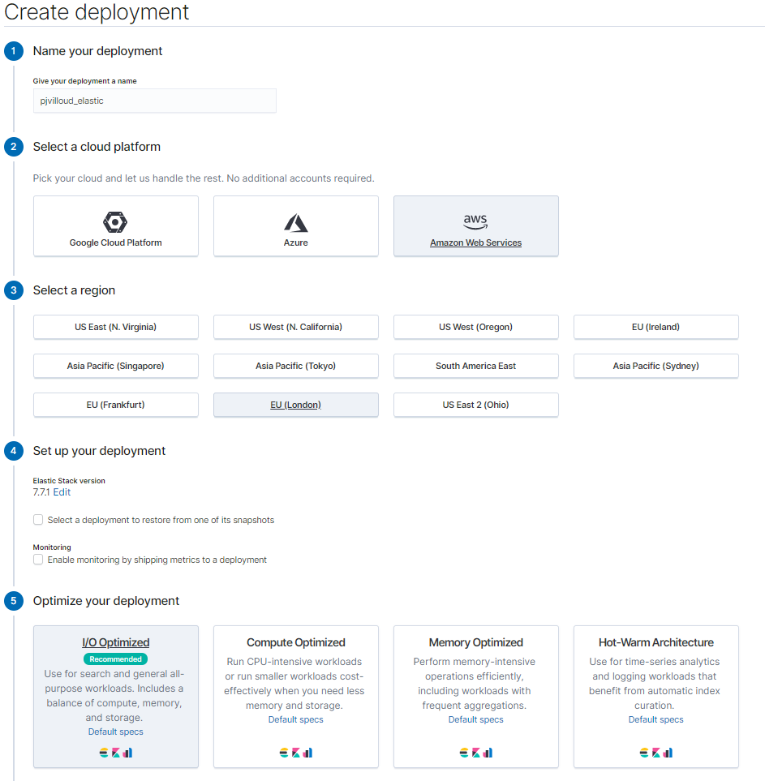
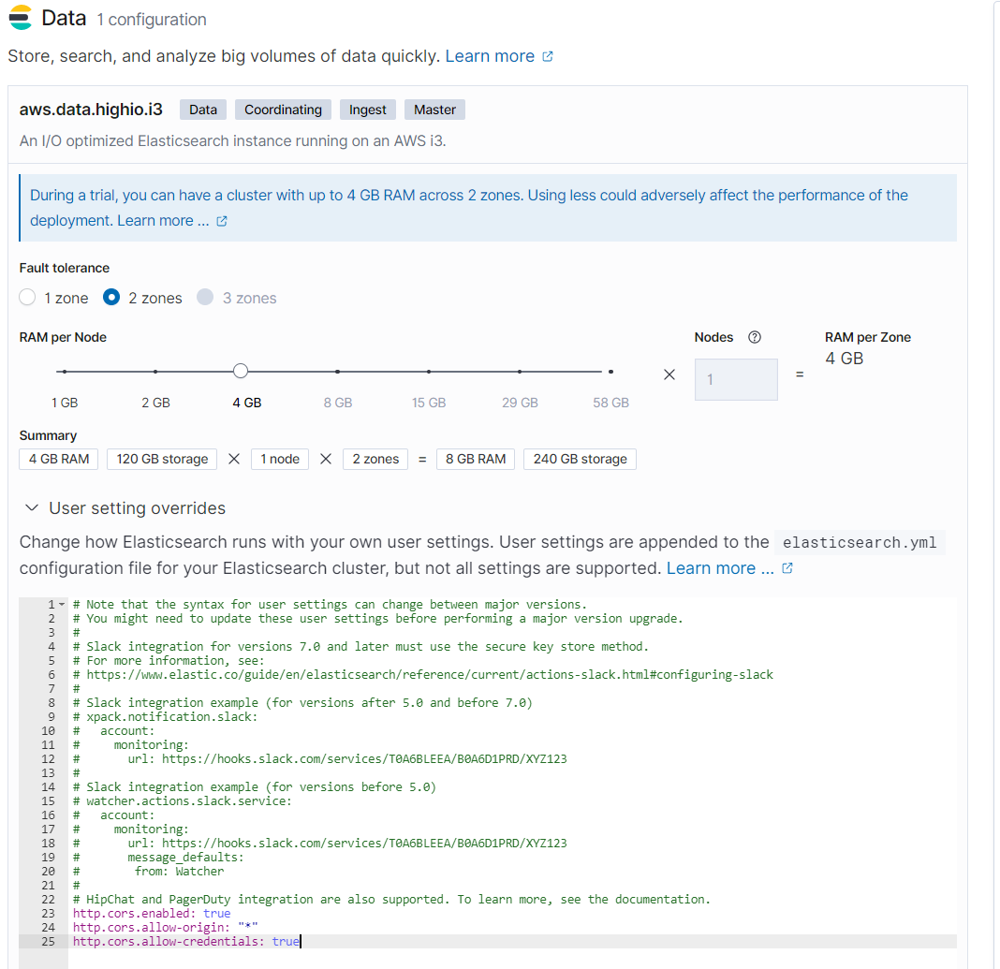

# ipi-elastic-ex
TP pour le cours sur la suite Elastic

## Création, installation et configuration de base des environnements

Afin de ménager vos machines, et afin de pouvoir accéder facilement à vos services, nous allons utiliser certains services de la suite Elastic en mode SaaS (Software as a Service) hébergé directement chez AWS via Elastic Cloud. Nous aurons besoin de PostMan (ou équivalent) ainsi que d'un environnement Java (IDE + JDK >= 11).

### Elastic Cloud

Voici la marche à suivre pour mettre en place votre suite Elastic (essai gratuit pendant 14 jours)

- Se connecter sur https://www.elastic.co/fr/cloud/
- Renseigner votre email dans l'espace *Elasticsearch Service* et cliquer sur **Essai**


- Sur l'écran suivant, répondez *Other* à la question **What is your evaluation goal during the trial?** et indiquer dans le champ texte *Formation*. Cliquer sur **Submit**


- Sur l'écran suivant, répondez *Observability...* à la question **What is your primray use case?**. Cliquer sur **Submit**


- Cliquer sur le lien reçu dans l'email de validation afin de valider votre email. On vous demandera alors de spécifier un mot de passe.
- Vous serez ensuite directement connecté sur Elastic Cloud. Vous pouvez maintenant cliquer sur **Start your free trial**


- Renseigner les champs comme dans la capture ci-dessous (en indiquant un nom de déploiement qui vous correspond) et cliquer sur **Customize deployment**


- Laisser tous les paramètres par défaut mais cliquer sur *User setting overrides* dans la section **Data** afin d'ajouter dans la zone de texte révélée les lignes suivantes : 
```yaml
http.cors.enabled: true
http.cors.allow-origin: "*"
http.cors.allow-credentials: true
http.cors.allow-headers: "X-Requested-With, Content-Type, Content-Length, Authorization"
```


- Cliquer ensuite sur **Create deployment** et attendez quelques minutes que le processus de déploiement soit effectué.
- Récupérer et mettre de côté le username/password indiqué

### Logstash

Télécharger Logstash à l'adresse https://artifacts.elastic.co/downloads/logstash/logstash-7.7.1.zip et décompresser l'archive sur votre machine (vous pouvez créer un répertoire `elastic` où vous mettrez tous les logiciels de ce tp)

### FileBeat

Télécharger FileBeat à l'adresse suivante et décompresser l'archive sur votre machine : 
- Pour Windows : https://artifacts.elastic.co/downloads/beats/filebeat/filebeat-7.7.1-windows-x86_64.zip
- Pour Linux : https://artifacts.elastic.co/downloads/beats/filebeat/filebeat-7.7.1-linux-x86_64.tar.gz

Procédure complète d'installation : https://www.elastic.co/guide/en/beats/filebeat/current/filebeat-installation.html

### HeartBeat

Télécharger HeartBeat à l'adresse suivante et décompresser l'archive sur votre machine : 
- Pour Windows : https://artifacts.elastic.co/downloads/beats/heartbeat/heartbeat-7.7.1-windows-x86_64.zip
- Pour Linux : https://artifacts.elastic.co/downloads/beats/filebeat/filebeat-7.7.1-linux-x86_64.tar.gz

### MetricBeat

Télécharger MetricBeat à l'adresse suivante et décompresser l'archive sur votre machine : 
- Pour Windows : https://artifacts.elastic.co/downloads/beats/metricbeat/metricbeat-7.7.1-windows-x86_64.zip
- Pour Linux : https://artifacts.elastic.co/downloads/beats/metricbeat/metricbeat-7.7.1-linux-x86_64.tar.gz
