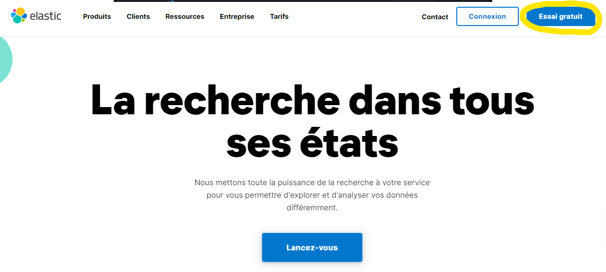
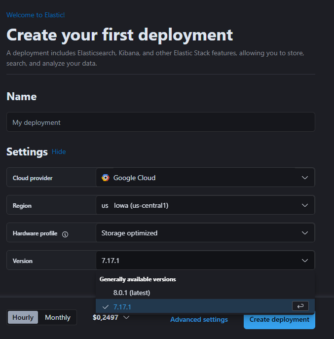

# ipi-elastic-ex
TP pour le cours sur la suite Elastic

## Création, installation et configuration de base des environnements

Afin de ménager vos machines, et afin de pouvoir accéder facilement à vos services, nous allons utiliser certains services de la suite Elastic en mode SaaS (Software as a Service) hébergé directement dans le cloud via Elastic Cloud. Nous aurons besoin de PostMan (ou équivalent) ainsi que d'un environnement Java (IDE + JDK >= 11).

### Elastic Cloud

Voici la marche à suivre pour mettre en place votre suite Elastic (essai gratuit pendant 14 jours)

- Se connecter sur https://www.elastic.co/fr/
- Cliquer sur **Essai gratuit**


- Sur l'écran suivant, renseignez un email et un mot de passe puis cliquez sur **Start free trial** ou connectez-vous avec votre compte Microsoft IPI en cliquant sur le bouton Microsoft.


- Cliquez ensuite sur le lien de vérification dans l'email de confirmation reçu.


- Votre déploiement Elastic s'apprête à être créé. Il vous faut juste lui donner un nom. Donnez le nom **nomfamille_elastic** à votre déploiement puis cliquez sur **Create deployment**. 


- Gardez bien le nom d'utilisateur et le mot de passe affiché à l'écran et attendez que le message **Your deployment is ready!** s'affiche avant de cliquer sur **Continue**


- Une fois le déploiement créé, vous devriez arriver sur cet écran.


- Ouvrez le menu à l'aide du bouton en haut à gauche et cliquer sur le bouton **Manage this deployment**.


- Descendez jusqu'à la section **Instances** cliquer sur le bouton avec les 3 points pour sélectionner **Edit configuration**


- Puis cliquez sur **Edit user settings and plugins** 


- Ajoutez dans la zone de texte révélée les lignes suivantes avant de cliquer sur **Back** puis **Save** tout en bas et enfin **Confirm** et attendez quelques minutes que les changements soient appliqués : 
```yaml
http.cors.enabled: true
http.cors.allow-origin: "*"
http.cors.allow-credentials: true
http.cors.allow-headers: "X-Requested-With, Content-Type, Content-Length, Authorization"
```


### Logstash

Télécharger Logstash à l'adresse https://www.elastic.co/fr/downloads/logstash et décompresser l'archive sur votre machine (vous pouvez créer un répertoire `elastic` où vous mettrez tous les logiciels de ce tp)

### FileBeat

Télécharger FileBeat à l'adresse https://www.elastic.co/fr/downloads/beats/filebeat et décompresser l'archive sur votre machine 

Procédure complète d'installation : https://www.elastic.co/guide/en/beats/filebeat/current/filebeat-installation.html

### HeartBeat

Télécharger HeartBeat à l'adresse https://www.elastic.co/fr/downloads/beats/heartbeat et décompresser l'archive sur votre machine

### MetricBeat

Télécharger MetricBeat à l'adresse https://www.elastic.co/fr/downloads/beats/metricbeat et décompresser l'archive sur votre machine : 
