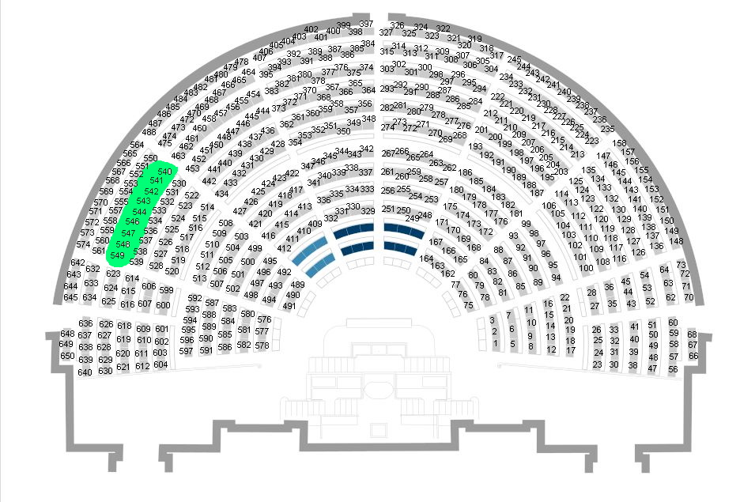

# Elasticsearch

## Index et indexations

1. Indexer le document suivant (identifiant 1) dans un index que l'on nommera `depute`

```json
{
    "id": 1,
    "nom": "Cédric Roussel",
    "nom_de_famille": "Roussel",
    "prenom": "Cédric",
    "sexe": "H",
    "date_naissance": "1872-10-10",
    "lieu_naissance": "Brest (Finistère)",
    "num_deptmt": "06",
    "nom_circo": "Alpes-Maritimes",
    "num_circo": 3,
    "mandat_debut": "2017-06-21",
    "groupe_sigle": "LREM",
    "parti_ratt_financier": "La République en Marche",
    "sites_web": [
        {
            "site": "http://cedricroussel.en-marche.fr"
        },
        {
            "site": "https://twitter.com/CedricRoussel06"
        },
        {
            "site": "https://fr-fr.facebook.com/CRoussel06/"
        },
        {
            "site": "https://www.cedricroussel.fr"
        }
    ],
    "emails": [
        {
            "email": "cedric.roussel@assemblee-nationale.fr"
        }
    ],
    "adresses": [
        {
            "adresse": "Assemblée nationale, 126 Rue de l'Université, 75355 Paris 07 SP"
        }
    ],
    "collaborateurs": [
        {
            "collaborateur": "Mme Julie Phan-Pérain"
        },
        {
            "collaborateur": "Mme Caroline Puisségur-Ripet"
        },
        {
            "collaborateur": "M. Jules Plat"
        }
    ],
    "autres_mandats": [],
    "anciens_autres_mandats": [],
    "anciens_mandats": [
        {
            "mandat": "21/06/2017 /  / "
        }
    ],
    "profession": "Conseiller en gestion de patrimoine indépendant",
    "place_en_hemicycle": "309",
    "url_an": "http://www2.assemblee-nationale.fr/deputes/fiche/OMC_PA718902",
    "id_an": "718902",
    "slug": "cedric-roussel",
    "url_nosdeputes": "https://www.nosdeputes.fr/cedric-roussel",
    "url_nosdeputes_api": "https://www.nosdeputes.fr/cedric-roussel/json",
    "nb_mandats": 1,
    "twitter": "CedricRoussel06"
}
```

1. Effectuer la requête permettant de récupérer le document précédemment indexé et analyser la réponse du serveur.

1. Effectuer la requête pour récupérer le mapping de l'index `depute` généré automatiquement et remarquer le type choisi automatiquement par Elasticsearch pour les champs 
- `groupe_sigle`
- `num_dptmt`
- `sexe`
- `nom_circo`
- `parti_ratt_financier`
- `date_naissance`

Sont-ils corrects ?

1. Effectuer la requête pour supprimer le document précédemment indexé. Vérifier qu'en essayant de le récupérer, on obtient bien une erreur.

1. Effectuer une requête pour modifier le mapping de l'index `depute` en spécifiant le type `keyword` pour les champs `groupe_sigle`, `num_dptmt`, `sexe`, `nom_circo`, `parti_ratt_financier`

1. Réindexer le document précédent et vérifier que tout est OK

1. Réindexer la totalité du document en modifiant la date de naissance de `1872-10-10` à `1972-10-10`. Vérifier la prise en compte de la modification et analyser le champ `version`.

1. En utilisant la documentation https://www.elastic.co/guide/en/elasticsearch/reference/current/docs-update.html modifier le document indexé pour ajouter un champ `nb_mandats_total` contenant le nombre de mandats (nombre d'éléments dans le tableau `anciens_mandats`)

1. Récupérer le mapping de l'index `depute` et constater l'ajout du champ avec le type automatiquement défini.

1. Indexer en masse tous les députés en utilisant le fichier `nosdeputes.fr_deputes_2020-06-16.bulk.json`. Analyser la réponse de votre requête pour vérifier s'il y a des erreurs. Essayer de récupérer en une requête les documents d'id `578`, `420`, `327`, `246`, `119` et `12`

## Recherche stricte

1. Effectuer la requête renvoyant tous les résultats des index `depute` et `people`. Vérifier que le nombre de résultats renvoyés semble correct.

1. Effectuer la requête renvoyant parmi les index `depute` et `people` les résultats contenant *Pierre* ou *Paul*. Analyser la réponse de votre requête. Comment sont classés les résultats ? Combien de résultats ont été trouvés ? Combien de résultats sont effectivement renvoyés ? 

1. Refaire la requête en renvoyant les 20 résultats suivants.

1. Effectuer une recherche renvoyant les députés dont le nom contient *Paul* ou *Pierre*.

1. Effectuer une recherche renvoyant les députés de la circonscription de la Loire.

1. Effectuer une recherche renvoyant les députés de la circonscription de la Loire ou de l'Isère. Analyser la réponse et essayer de trouver la différence par rapport à la question 4.

1. Reprendre l'énoncé de la question 2 mais chercher uniquement dans le nom ou le prénom du député.

1. Rechercher les députés qui ont au moins une femme parmi leur collaborateurs

1. Rechercher les députés en vert sur l'image suivante : 


1. Rechercher les députés sortants

## Recherche floue/intervalle

1. Rechercher le nom *Katabi* en activant la recherche floue. Constatez les résultats obtenus.

1. Rechercher les députés qui ont 3 mandats ou plus.

## Bonus

1. Supprimer l'index `depute` et créer le mapping suivant :
```json
{
    "mappings": {
        "properties": {
            "sexe": {
                "type": "keyword"
            },
            "date_naissance": {
                "type": "date",
                "format": "yyyy-MM-dd"
            },
            "mandat_debut": {
                "type": "date",
                "format": "yyyy-MM-dd"
            },
            "mandat_fin": {
                "type": "date",
                "format": "yyyy-MM-dd"
            },
            "num_deptmt": {
                "type": "keyword"
            },
            "nom_circo": {
                "type": "keyword"
            },
            "groupe_sigle": {
                "type": "keyword"
            },
            "parti_ratt_financier": {
                "type": "keyword"
            },
            "prenom": {
                "type": "text",
                "analyzer": "phoneticAnalyzer"
            }
        }
    },
    "settings": {
        "index": {
            "analysis": {
                "analyzer": {
                    "phoneticAnalyzer": {
                        "tokenizer": "standard",
                        "filter": [
                            "lowercase",
                            "my_metaphone"
                        ]
                    }
                },
                "filter": {
                    "my_metaphone": {
                        "type": "phonetic",
                        "encoder": "metaphone",
                        "replace": false
                    }
                }
            }
        }
    }
}
```
Réindexer les données de tous les députés et faire une recherche sur le prénom "Sandra". Que constatez-vous ?

## Aggrégations

1. Récuperer le nombre de députés de sexe féminin et de sexe masculin en une requête

1. Regrouper les députés en fonction du nombre de semaine de présence, par tranches de 5 semaines.

1. Récupérer les députés maladivement timides (0 questions orales, 0 interventions courtes, 0 interventions longues)

1. Regrouper les députés par tranche d'âge (tous les 5 ans)


